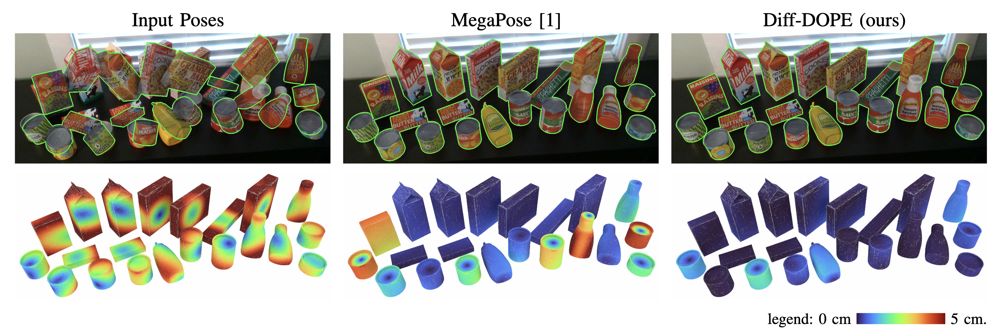

# Diff-DOPE

A 6-DoF pose refiner that takes as input an image, a 3d model, and an initial object pose. The method then outputs the pose of the object using a differentiable renderer that minimizes the object reprojection error (rgb, depth, edges, mask, etc.).

Code and data to be release soon (pending internal approval). 
